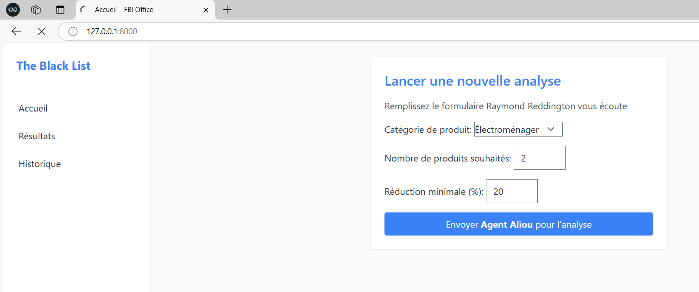
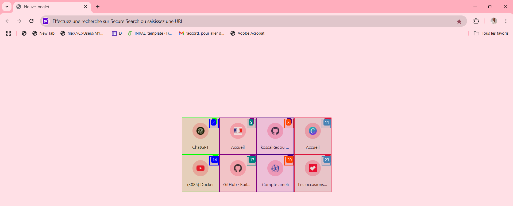
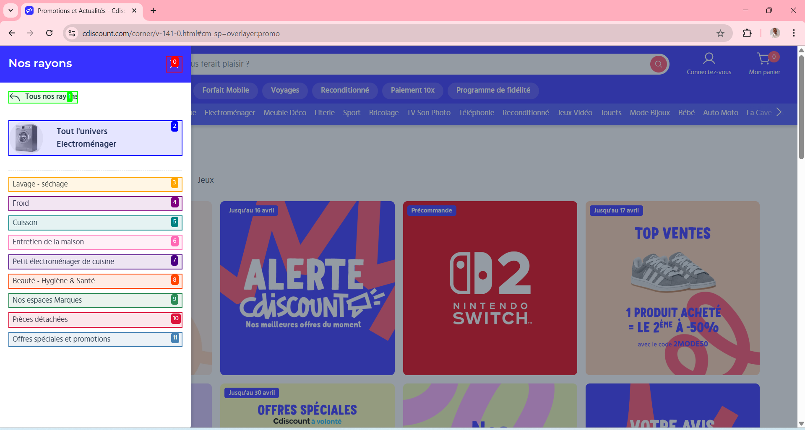
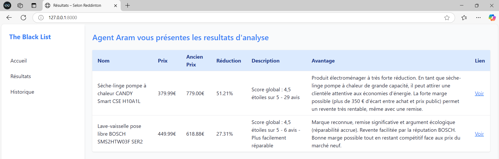
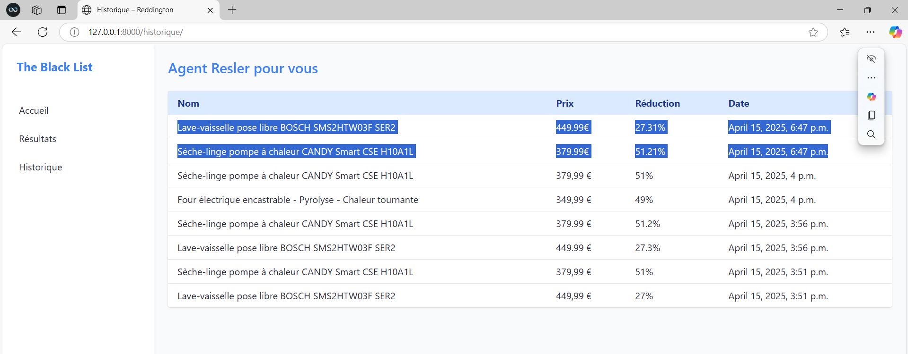

# Agent Reddington – Web Scraper Intelligent

Un agent AI basé sur **Browser-Use** et **Django** pour détecter automatiquement les **bons plans produits** sur un site e-commerce (ex: Cdiscount) et générer un rapport exploitable pour l’achat-revente.

---

## Fonctionnalités

-  Navigation autonome sur site web via LLM
-  Analyse de rentabilité produit
-  Résultats structurés (JSON + affichage web)
-  Historique des analyses
-  Envoi automatique par email

---

##  Stack

- Django
- Tailwind CSS + Flowbite
- Langchain + GPT-4.1
- Browser-Use
- SQLite

---

##  Interface UX/UI & Fonctionnement







---
## Auteur

**Aliou DIALLO**
Dév Python/Django & IA

##  Démarrage rapide

```bash
git clone https://github.com/kossaiRedou/TheBlackList-Agent_IA-pour_le_WebScrapping.git)
cd Reddington
python -m venv venv
source venv/bin/activate  # ou .\venv\Scripts\activate
pip install -r requirements.txt
python manage.py runserver
